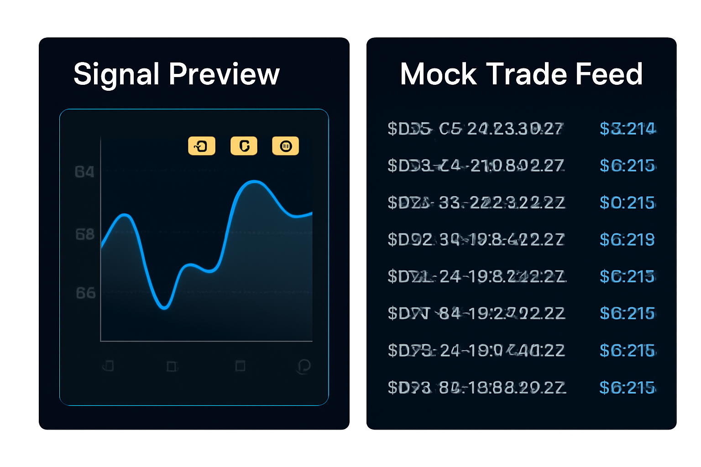

# 📊 Polymarket Daily Dashboard — Open-Source Analytics (MVP Build)

A modern analytics dashboard designed to make Polymarket markets easier to explore, understand, and trade.  
Built with a focus on **orderbook clarity**, **spread detection**, **mock CLOB data**, and **AI-ready architecture**.

<p align="center">
  
</p>

<p align="center">
  
  
  
</p>

---

## 📚 Table of Contents
- [Key Features](#-key-features-mvp)
- [Dashboard Previews](#-dashboard-previews)
- [Project Structure](#-project-structure)
- [Included Mock Datasets](#-included-mock-datasets)
- [Tech Stack](#-tech-stack)
- [Architecture](#-architecture)
- [API Whitelist Request](#-api-whitelist-request)
- [Why This Dashboard Matters](#-why-this-dashboard-matters)
- [Local Development](#-local-development)
- [Roadmap](#-roadmap-dec-2025)
- [Contributing](#-contributing)
- [License](#-license)

---

# 🚀 Key Features (MVP)

### 📈 Spread Scanner  
Quick insights across high-volume Polymarket markets based on real-time spreads (0.1–0.8).

### 📊 Market Digest  
Highlights biggest movers, new markets, and short-term volatility events.

### 🤖 AI Explainer Panel *(Coming Soon)*  
Explains *why* a market moved using orderbook pressure + trade flows.

### 📉 Orderbook Depth  
Mock CLOB-style visualization for accurate UX preview before API whitelist approval.

### 📱 Mobile UI  
Fully responsive and mobile-first.

### 📦 Mock Data Layer  
Allows full UI development **without CLOB API access**.

---

# 🖼️ Dashboard Previews

> **Note:** All preview images in `/assets/` are mock UI designs for demonstration purposes only.

## 🔥 1. Main Dashboard Overview  
<p align="center">
  
</p>

---

## ⚡ 2. Spread & Liquidity Heatmap  
<p align="center">
  
</p>

---

## 📱 3. Mobile UI & Price Stats  
<p align="center">
  
</p>

---

## 🟢 4. Signals + Orderbook Depth  
<p align="center">
  
</p>

---

# 📁 Project Structure

```
polymarket-daily-dashboard/
│── assets/
│   ├── 1.png
│   ├── 2.png
│   ├── 3.png
│   ├── 4.png
│   └── .gitkeep
│
│── mock-data/
│   ├── mock_orderbook.json
│   ├── mock_trades.json
│   ├── mock_spread_history.json
│   └── .gitkeep
│
│── public/
│── src/
│── dashboard-preview.png
│── README.md
│── LICENSE
```

---

# 📦 Included Mock Datasets

### 🟦 `mock_orderbook.json`
Simulated CLOB-style orderbook with:
- Bid / Ask levels  
- Depth (L1–L5)  
- Spread  
- Liquidity imbalance  

---

### 🟧 `mock_trades.json`
Synthetic trade feed including:
- timestamp  
- price  
- size  
- buy/sell  
- impact score  

---

### 🟥 `mock_spread_history.json`
Time-series spread tracker for:
- market heatmaps  
- microtrend detection  
- volatility alerts  

> These datasets allow **full UI development without API access**.

---

# 🛠️ Tech Stack

- **React (Vite)**
- **Tailwind CSS**
- **Recharts**
- **Mock REST Layer**
- *(Planned: CLOB REST + WebSocket Streaming)*

---

# 🧠 Architecture

```
Frontend (React)
│
├── UI Components
│   ├── Dashboard
│   ├── Spread Scanner
│   ├── Orderbook Depth
│   ├── AI Explainer (future)
│
├── Data Layer
│   ├── mock_orderbook.json
│   ├── mock_trades.json
│   └── mock_spread_history.json
│
└── Integration Layer (Soon)
    ├── CLOB REST API
    ├── WebSocket Streams
```

---

# 🔐 API Whitelist Request

📌 **Status:**  
- Request submitted  
- Ticket open  
- Awaiting engineering review  

📌 **Integration Ready:**  
This project is structured for immediate API integration once approved:
- Orderbook endpoint  
- Markets feed  
- Trades feed  
- WebSocket updates  

---

# 🌟 Why This Dashboard Matters

Polymarket is rapidly expanding — but analytics, spreads, liquidity clarity, and exploration tools still have gaps.

This dashboard aims to solve that by:

### ✔ Providing clean orderbook visualizations  
### ✔ Detecting spreads + liquidity pressure  
### ✔ Simplifying market discovery  
### ✔ Preparing for AI-powered reasoning features  
### ✔ Supporting the builder ecosystem with reusable components  

It's designed as both a **useful public tool** and a **robust builder contribution**.

---

# 🛠️ Local Development

### Clone
```bash
git clone https://github.com/mailcrypto23/polymarket-daily-dashboard
cd polymarket-daily-dashboard
```

### Install
```bash
npm install
```

### Run
```bash
npm run dev
```

---

# 🔮 Roadmap (Dec 2025)

### **Phase 1 — UI Complete**
✔ Dashboard  
✔ Mobile UI  
✔ Spread Scanner  
✔ Mock Datasets  
✔ All Preview Assets  

### **Phase 2 — API Integration**
▢ CLOB REST  
▢ WebSocket live updates  
▢ Positions analyzer  

### **Phase 3 — AI Assist**
▢ AI Explainer  
▢ Market reasoning  
▢ Chat assistant  

### **Phase 4 — Alerts System**
▢ Spread alerts  
▢ Volume spikes  
▢ Liquidity shocks  

---

# 🤝 Contributing  
PRs, ideas, and improvements are welcome!

---

# 📜 License  
MIT License — free to use, modify, and distribute.
